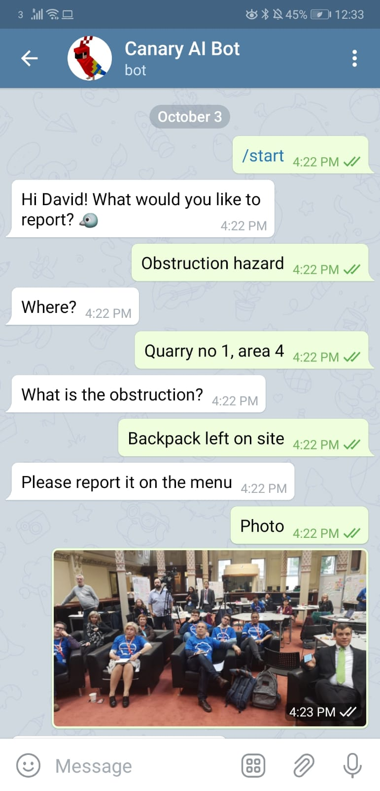
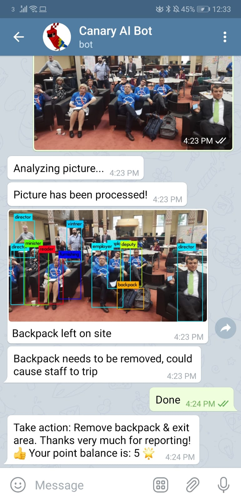
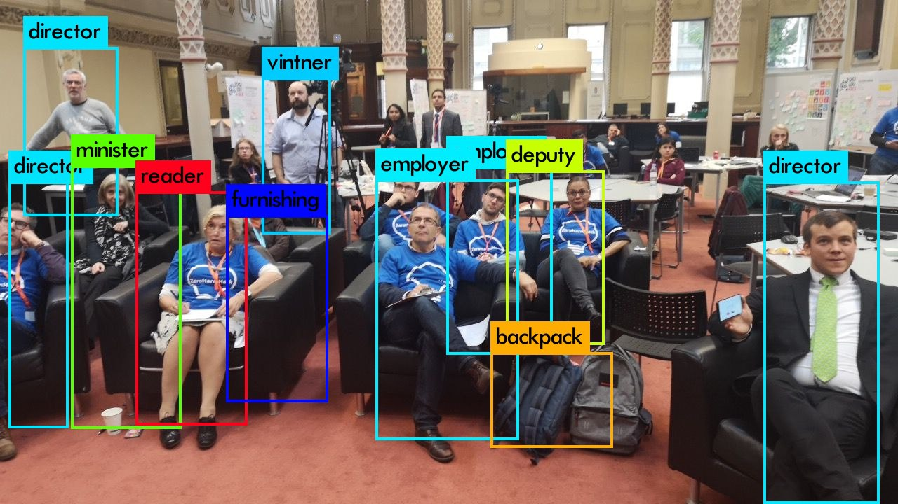

# Digital Edu Hack 2019: Canary AI

We developed Canary AI ChatBot for Zero-Harm workplace for miners that uses Computer Vision, AI & Data Analytics

[CanaryAI at DigiEduHack in Dublin October 2019](https://docs.google.com/presentation/d/1WuO9cWLMO0bI6BLa7bFO6DmsfRDiDGcSPYE9rjwmUjA/edit?usp=sharing)

[CanaryAI on Twitter](https://twitter.com/CanaryAI1)

## Technologies

* Python 3
* [Telgram](http://telegram.org/)
* [Python Telegram Bot](https://github.com/python-telegram-bot/python-telegram-bot)

# Demo Screenshots








## Deployment

1. Build our docker image:
```
$ cd docker
$ make build
```

2. Create a docker container based on the image:
```
$ make run
```

3. SSH to the docker container:
```
$ make dev
```

4. Start your bot:
```
$ python src/bot.py
```

## Contributors

* [David Azcona](https://github.com/dazcona)
* [Enric Moreu](https://github.com/enric1994)
* Miriam O'Flynn